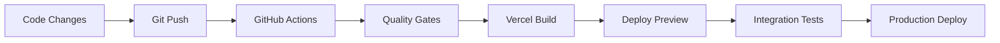

# 🚀 Vercel Auto-Deployment Setup Guide

## 🎯 **Complete Vercel Integration for HERA Universal**

This guide will help you set up automatic deployments from GitHub to Vercel with enterprise-grade quality gates and monitoring.

---

## 📋 **Quick Fix for Auto-Deployment Issues**

### **Common Causes & Solutions:**

#### **1. 🔗 GitHub Connection Issues**
```bash
# Check if Vercel is properly connected to GitHub
# Go to Vercel Dashboard > Settings > Git Repository
# Ensure the repository is connected and has proper permissions
```

#### **2. 🔧 Build Configuration Problems**
```bash
# Verify these settings in Vercel Dashboard:
Framework Preset: Next.js
Build Command: npm run build
Output Directory: .next
Install Command: npm ci
Development Command: npm run dev
```

#### **3. 🌿 Branch Settings**
```bash
# In Vercel Dashboard > Settings > Git:
Production Branch: main
Auto-deploy: Enabled for all branches
```

---

## 🛠️ **Step-by-Step Setup**

### **Step 1: Vercel Dashboard Configuration**

1. **Go to Vercel Dashboard** → [vercel.com/dashboard](https://vercel.com/dashboard)
2. **Select your HERA Universal project**
3. **Go to Settings → Git**
4. **Verify these settings:**
   ```
   ✅ Repository: Connected to GitHub
   ✅ Production Branch: main
   ✅ Auto-deploy: Enabled
   ✅ Preview deployments: Enabled for all branches
   ```

### **Step 2: Environment Variables Setup**

In **Vercel Dashboard → Settings → Environment Variables**, add:

```bash
# Required for HERA Universal
NEXT_PUBLIC_SUPABASE_URL=your_supabase_url
NEXT_PUBLIC_SUPABASE_ANON_KEY=your_supabase_anon_key
SUPABASE_SERVICE_ROLE_KEY=your_service_role_key

# AI Integration
CLAUDE_API_KEY=your_claude_api_key
OPENAI_API_KEY=your_openai_api_key

# Build Optimization
NEXT_TELEMETRY_DISABLED=1
NODE_ENV=production
```

### **Step 3: GitHub Repository Secrets**

In **GitHub Repository → Settings → Secrets and Variables → Actions**, add:

```bash
# Vercel Integration
VERCEL_TOKEN=your_vercel_token
VERCEL_ORG_ID=your_vercel_org_id  
VERCEL_PROJECT_ID=your_vercel_project_id

# Optional: Slack Notifications
SLACK_WEBHOOK_URL=your_slack_webhook
```

### **Step 4: Force Deployment Trigger**

```bash
# Option 1: Make a small change and push
echo "# Trigger deployment $(date)" >> README.md
git add README.md
git commit -m "🚀 Trigger Vercel auto-deployment"
git push origin main

# Option 2: Use Vercel CLI to force redeploy
npx vercel --prod --force

# Option 3: Create empty commit to trigger
git commit --allow-empty -m "🚀 Force Vercel deployment trigger"
git push origin main
```

---

## 🔧 **Advanced Configuration**

### **Custom Build Commands**

Update `vercel.json` for optimal performance:

```json
{
  "buildCommand": "npm run build",
  "outputDirectory": ".next",
  "installCommand": "npm ci --only=production",
  "framework": "nextjs",
  "functions": {
    "app/api/**/*.ts": {
      "maxDuration": 30
    }
  }
}
```

### **Performance Optimization**

```json
{
  "headers": [
    {
      "source": "/(.*)",
      "headers": [
        {
          "key": "Cache-Control",
          "value": "public, max-age=3600, stale-while-revalidate=86400"
        }
      ]
    }
  ]
}
```

### **Security Headers**

```json
{
  "headers": [
    {
      "source": "/(.*)",
      "headers": [
        {
          "key": "X-Content-Type-Options",
          "value": "nosniff"
        },
        {
          "key": "X-Frame-Options", 
          "value": "DENY"
        },
        {
          "key": "X-XSS-Protection",
          "value": "1; mode=block"
        },
        {
          "key": "Strict-Transport-Security",
          "value": "max-age=31536000; includeSubDomains"
        }
      ]
    }
  ]
}
```

---

## 🚨 **Troubleshooting Auto-Deployment**

### **Issue 1: "Vercel not detecting changes"**

**Solution:**
```bash
# 1. Check webhook delivery in GitHub
# Go to: Repository → Settings → Webhooks
# Look for Vercel webhook and check recent deliveries

# 2. Re-connect repository in Vercel
# Vercel Dashboard → Settings → Git → Disconnect → Reconnect

# 3. Force sync with Vercel CLI
npx vercel link
npx vercel env pull
npx vercel deploy --force
```

### **Issue 2: "Build failing on Vercel but works locally"**

**Solution:**
```bash
# 1. Check Node.js version compatibility
# Ensure package.json has engines field:
{
  "engines": {
    "node": ">=18.0.0",
    "npm": ">=8.0.0"
  }
}

# 2. Check environment variables
# Ensure all required env vars are set in Vercel Dashboard

# 3. Check build logs in Vercel Dashboard
# Look for specific error messages
```

### **Issue 3: "GitHub Actions integration not working"**

**Solution:**
```bash
# 1. Check repository secrets
# Ensure VERCEL_TOKEN, VERCEL_ORG_ID, VERCEL_PROJECT_ID are set

# 2. Get Vercel tokens:
# Token: https://vercel.com/account/tokens
# Org ID: https://vercel.com/teams/[team]/settings
# Project ID: https://vercel.com/[team]/[project]/settings

# 3. Test GitHub Actions workflow
# Make a commit to trigger the workflow
```

---

## 📊 **Monitoring & Alerting**

### **Deployment Status Monitoring**

```bash
# Add this to your monitoring dashboard
curl -f https://your-app.vercel.app/api/health

# Expected response:
{
  "status": "healthy",
  "timestamp": "2024-01-15T10:30:00Z",
  "version": "1.0.0",
  "services": {
    "database": "connected",
    "ai_engine": "operational",
    "scanner": "ready"
  }
}
```

### **Performance Monitoring**

```bash
# Lighthouse CI integration
npm install -g @lhci/cli
lhci collect --url=https://your-app.vercel.app
lhci assert --preset=lighthouse:recommended
```

### **Error Tracking**

```bash
# Add to your Next.js app
npm install @vercel/analytics @vercel/speed-insights

# In app/layout.tsx:
import { Analytics } from '@vercel/analytics/react';
import { SpeedInsights } from '@vercel/speed-insights/next';

export default function RootLayout() {
  return (
    <html>
      <body>
        {children}
        <Analytics />
        <SpeedInsights />
      </body>
    </html>
  );
}
```

---

## 🚀 **Auto-Deployment Workflow**

### **1. Development Process**


### **2. Quality Gates Process**
```bash
1. 🔍 TypeScript compilation
2. 🎨 ESLint validation  
3. 🧪 Unit tests execution
4. 🏗️ Build verification
5. 🚀 Deployment trigger
6. 🩺 Health checks
7. ⚡ Performance audit
8. 📊 Integration tests
```

### **3. Rollback Strategy**
```bash
# Automatic rollback triggers:
- Health check failures
- Performance degradation > 20%
- Error rate > 5%

# Manual rollback:
vercel rollback --token=$VERCEL_TOKEN
```

---

## 🎯 **Best Practices**

### **Branch Strategy**
```bash
# Production deployments
main → Automatic production deployment

# Preview deployments  
feature/* → Automatic preview deployment
develop → Automatic staging deployment
```

### **Environment Management**
```bash
# Use different environment variables per branch
production: NEXT_PUBLIC_API_URL=https://api.hera-universal.com
preview: NEXT_PUBLIC_API_URL=https://api-staging.hera-universal.com
development: NEXT_PUBLIC_API_URL=http://localhost:3001
```

### **Performance Optimization**
```bash
# Enable Vercel Speed Insights
# Enable Vercel Web Analytics
# Use Image Optimization
# Enable Edge Functions for API routes
# Configure appropriate caching headers
```

---

## 🏆 **Success Metrics**

### **Deployment KPIs**
- ⚡ **Build Time**: < 2 minutes
- 🚀 **Deploy Time**: < 30 seconds  
- 📊 **Success Rate**: > 99%
- 🩺 **Health Check**: < 5 seconds
- ⚡ **Performance Score**: > 90

### **Monitoring Dashboard**
```bash
# Key metrics to track:
- Deployment frequency
- Lead time for changes
- Mean time to recovery
- Change failure rate
- Performance scores
- Error rates
```

---

## 🎉 **Validation Checklist**

### **✅ Auto-Deployment Working**
- [ ] Code changes trigger automatic builds
- [ ] Quality gates prevent bad deployments
- [ ] Health checks validate deployments
- [ ] Performance monitoring active
- [ ] Error tracking configured
- [ ] Rollback strategy tested

### **✅ Enterprise Features**
- [ ] Multi-environment support
- [ ] Security headers configured
- [ ] Performance optimization enabled
- [ ] Monitoring and alerting setup
- [ ] Team notifications working
- [ ] Documentation complete

---

**🚀 Ready for world-class auto-deployment with enterprise-grade quality gates!** 🌟

Need help? Check the troubleshooting section or contact the team! 📞