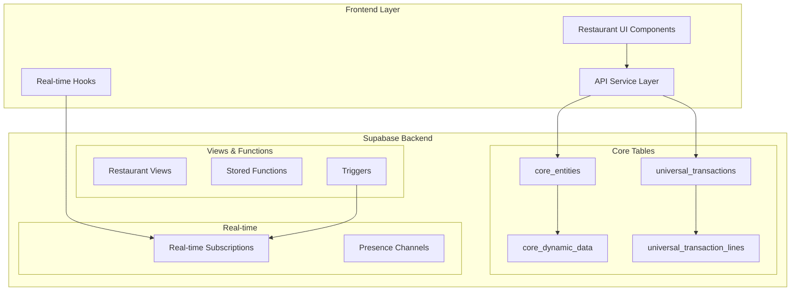

# 🍽️ Restaurant Backend Integration Plan
## Following Universal Master Data & Transaction Principles

### 🏗️ Architecture Overview



## 📊 Phase 1: Core Restaurant Entities (Week 1)

### 1.1 Menu Management
```sql
-- Menu Items as core_entities
INSERT INTO core_entities (entity_type, name, metadata, organization_id) VALUES
('menu_item', 'Butter Chicken', 
 '{
   "category": "main_course",
   "cuisine": "indian",
   "spice_level": 2,
   "dietary": ["gluten_free"],
   "image_url": "...",
   "preparation_time": 20
 }', 
 'restaurant_123');

-- Dynamic pricing and attributes in core_dynamic_data
INSERT INTO core_dynamic_data (entity_id, field_name, field_value, field_type) VALUES
('menu_item_id', 'price', '18.99', 'decimal'),
('menu_item_id', 'cost', '6.50', 'decimal'),
('menu_item_id', 'calories', '650', 'integer'),
('menu_item_id', 'ingredients', '["chicken", "tomato", "cream", "spices"]', 'json');
```

### 1.2 Table Management
```sql
-- Tables as core_entities
INSERT INTO core_entities (entity_type, name, metadata) VALUES
('restaurant_table', 'Table 1', 
 '{
   "seats": 4,
   "section": "main_dining",
   "features": ["window_view"],
   "qr_code": "TBL001"
 }');
```

### 1.3 Staff Management
```sql
-- Restaurant staff as core_entities
INSERT INTO core_entities (entity_type, name, metadata) VALUES
('restaurant_staff', 'John Doe',
 '{
   "employee_id": "EMP001",
   "department": "service",
   "shift_preference": "morning"
 }');

-- Dynamic attributes
INSERT INTO core_dynamic_data VALUES
('staff_id', 'role', 'waiter', 'text'),
('staff_id', 'permissions', '["take_order", "process_payment"]', 'json'),
('staff_id', 'hourly_rate', '15.50', 'decimal');
```

## 🔄 Phase 2: Universal Transaction Integration (Week 2)

### 2.1 Order Transaction Type
```typescript
interface RestaurantOrderTransaction extends UniversalTransaction {
  transaction_type: 'restaurant_order';
  metadata: {
    table_id: string;
    waiter_id: string;
    order_type: 'dine_in' | 'takeout' | 'delivery';
    customer_count: number;
    special_instructions: string;
  };
}

// Transaction Lines for Order Items
interface OrderLineItem extends UniversalTransactionLine {
  metadata: {
    menu_item_id: string;
    quantity: number;
    modifications: string[];
    preparation_status: 'pending' | 'preparing' | 'ready' | 'served';
    kitchen_notes: string;
  };
}
```

### 2.2 Inventory Transaction Type
```typescript
interface InventoryTransaction extends UniversalTransaction {
  transaction_type: 'inventory_movement';
  metadata: {
    movement_type: 'purchase' | 'consumption' | 'waste' | 'transfer';
    supplier_id?: string;
    reason?: string;
    batch_number?: string;
  };
}
```

### 2.3 Payment Settlement
```typescript
interface PaymentTransaction extends UniversalTransaction {
  transaction_type: 'payment';
  metadata: {
    payment_method: 'cash' | 'card' | 'digital_wallet';
    order_id: string;
    tip_amount: number;
    payment_processor: string;
    authorization_code?: string;
  };
}
```

## 🚀 Phase 3: Real-time Systems (Week 3)

### 3.1 Order Management Real-time Flow
```typescript
// Supabase Real-time Subscription
const orderChannel = supabase
  .channel('restaurant-orders')
  .on(
    'postgres_changes',
    {
      event: '*',
      schema: 'public',
      table: 'universal_transactions',
      filter: `organization_id=eq.${restaurantId} AND transaction_type=eq.restaurant_order`
    },
    (payload) => {
      // Update UI based on order status
      handleOrderUpdate(payload);
    }
  )
  .subscribe();
```

### 3.2 Kitchen Display System
```sql
-- Create view for kitchen orders
CREATE VIEW kitchen_orders AS
SELECT 
  ut.id as order_id,
  ut.transaction_date as order_time,
  ut.metadata->>'table_id' as table_number,
  ut.status as order_status,
  utl.metadata->>'menu_item_id' as item_id,
  utl.quantity,
  utl.metadata->>'modifications' as modifications,
  utl.metadata->>'preparation_status' as prep_status,
  ce.name as item_name,
  ce.metadata->>'preparation_time' as prep_time
FROM universal_transactions ut
JOIN universal_transaction_lines utl ON ut.id = utl.transaction_id
JOIN core_entities ce ON utl.metadata->>'menu_item_id' = ce.id
WHERE ut.transaction_type = 'restaurant_order'
  AND ut.status IN ('APPROVED', 'IN_PROGRESS')
ORDER BY ut.transaction_date ASC;
```

### 3.3 Table Status Tracking
```typescript
// Real-time table status using Supabase Presence
const tablePresence = supabase.channel('table-status')
  .on('presence', { event: 'sync' }, () => {
    const state = tablePresence.presenceState();
    updateTableStatuses(state);
  })
  .subscribe(async (status) => {
    if (status === 'SUBSCRIBED') {
      await tablePresence.track({
        table_id: tableId,
        status: 'occupied',
        waiter_id: waiterId,
        order_id: currentOrderId,
        seated_at: new Date().toISOString()
      });
    }
  });
```

## 🔐 Phase 4: Security & RLS Policies (Week 4)

### 4.1 Row Level Security
```sql
-- Enable RLS on all tables
ALTER TABLE core_entities ENABLE ROW LEVEL SECURITY;
ALTER TABLE universal_transactions ENABLE ROW LEVEL SECURITY;

-- Restaurant staff can only see their organization's data
CREATE POLICY "Restaurant staff access" ON core_entities
  FOR ALL USING (
    organization_id = auth.jwt()->>'organization_id'
    AND auth.jwt()->>'role' IN ('admin', 'manager', 'waiter', 'chef', 'cashier')
  );

-- Waiters can create orders but not modify financial data
CREATE POLICY "Waiter create orders" ON universal_transactions
  FOR INSERT WITH CHECK (
    transaction_type = 'restaurant_order'
    AND auth.jwt()->>'role' IN ('waiter', 'manager', 'admin')
  );

-- Only managers can void transactions
CREATE POLICY "Manager void transactions" ON universal_transactions
  FOR UPDATE USING (
    auth.jwt()->>'role' IN ('manager', 'admin')
    AND status = 'CANCELLED'
  );
```

### 4.2 API Security Layer
```typescript
// API service with built-in security
export class RestaurantAPIService {
  async createOrder(orderData: CreateOrderDTO): Promise<RestaurantOrderTransaction> {
    // Validate permissions
    const { data: staff } = await supabase
      .from('core_entities')
      .select('*')
      .eq('id', orderData.waiter_id)
      .single();
    
    if (!staff || !this.hasPermission(staff, 'take_order')) {
      throw new Error('Insufficient permissions');
    }
    
    // Create transaction with AI validation
    const transaction = await heraTransactions.create({
      transaction_type: 'restaurant_order',
      ...orderData,
      ai_metadata: {
        confidence_score: 0.95,
        fraud_risk_score: 0.02,
        validation_status: 'PASSED'
      }
    });
    
    return transaction;
  }
}
```

## 🤖 Phase 5: AI Integration (Week 5)

### 5.1 Intelligent Order Recommendations
```typescript
// AI-powered menu recommendations
const getAIRecommendations = async (customerId: string, context: any) => {
  const orderHistory = await supabase
    .from('universal_transactions')
    .select('*, universal_transaction_lines(*)')
    .eq('metadata->customer_id', customerId)
    .order('transaction_date', { ascending: false })
    .limit(10);
  
  const recommendations = await generateRecommendations({
    history: orderHistory,
    context: {
      time_of_day: context.timeOfDay,
      weather: context.weather,
      special_events: context.events
    }
  });
  
  return recommendations;
};
```

### 5.2 Fraud Detection
```typescript
// AI fraud detection for payments
const validatePayment = async (payment: PaymentTransaction) => {
  const fraudCheck = await heraTransactions.analyzeFraud({
    transaction: payment,
    patterns: ['unusual_tip', 'rapid_transactions', 'location_mismatch']
  });
  
  if (fraudCheck.risk_score > 0.7) {
    payment.status = 'PENDING_REVIEW';
    payment.ai_metadata.fraud_alert = fraudCheck.details;
  }
  
  return payment;
};
```

## 📈 Phase 6: Analytics & Reporting (Week 6)

### 6.1 Real-time Dashboard Views
```sql
-- Sales performance view
CREATE VIEW restaurant_sales_analytics AS
SELECT 
  DATE_TRUNC('day', transaction_date) as date,
  COUNT(DISTINCT id) as order_count,
  SUM(total_amount) as revenue,
  AVG(total_amount) as avg_order_value,
  COUNT(DISTINCT metadata->>'waiter_id') as active_staff,
  SUM(CASE WHEN status = 'CANCELLED' THEN 1 ELSE 0 END) as cancelled_orders
FROM universal_transactions
WHERE transaction_type = 'restaurant_order'
GROUP BY DATE_TRUNC('day', transaction_date);

-- Popular items view
CREATE VIEW popular_menu_items AS
SELECT 
  ce.name as item_name,
  ce.metadata->>'category' as category,
  COUNT(utl.id) as times_ordered,
  SUM(utl.quantity) as total_quantity,
  AVG(utl.unit_price) as avg_price,
  SUM(utl.total_amount) as total_revenue
FROM universal_transaction_lines utl
JOIN core_entities ce ON utl.metadata->>'menu_item_id' = ce.id
JOIN universal_transactions ut ON utl.transaction_id = ut.id
WHERE ut.transaction_type = 'restaurant_order'
  AND ut.status = 'COMPLETED'
GROUP BY ce.id, ce.name, ce.metadata->>'category'
ORDER BY times_ordered DESC;
```

## 🔧 Implementation Services

### Service Layer Architecture
```typescript
// services/restaurant/index.ts
export { MenuService } from './menu.service';
export { OrderService } from './order.service';
export { InventoryService } from './inventory.service';
export { PaymentService } from './payment.service';
export { TableService } from './table.service';
export { StaffService } from './staff.service';
export { AnalyticsService } from './analytics.service';

// Base service pattern
export class BaseRestaurantService {
  protected supabase: SupabaseClient;
  protected organizationId: string;
  
  constructor(supabase: SupabaseClient, organizationId: string) {
    this.supabase = supabase;
    this.organizationId = organizationId;
  }
  
  protected async validateAccess(userId: string, permission: string): Promise<boolean> {
    // Implement permission checking
  }
  
  protected async auditLog(action: string, data: any): Promise<void> {
    // Implement audit logging
  }
}
```

## 📱 Frontend Integration Pattern

```typescript
// hooks/restaurant/useRestaurantData.ts
export const useOrders = () => {
  const [orders, setOrders] = useState<RestaurantOrderTransaction[]>([]);
  
  useEffect(() => {
    // Initial fetch
    fetchOrders();
    
    // Real-time subscription
    const subscription = subscribeToOrders((payload) => {
      handleOrderChange(payload);
    });
    
    return () => subscription.unsubscribe();
  }, []);
  
  return { orders, isLoading, error };
};
```

## 🚦 Migration Strategy

1. **Week 1**: Set up core entities and test data
2. **Week 2**: Implement transaction types and workflows
3. **Week 3**: Enable real-time features
4. **Week 4**: Apply security policies
5. **Week 5**: Integrate AI features
6. **Week 6**: Deploy analytics and monitoring

## 🎯 Success Metrics

- Order processing time < 100ms
- Real-time updates latency < 50ms
- 99.9% uptime for critical operations
- Zero data loss with audit trails
- AI fraud detection accuracy > 95%

This plan leverages your existing universal architecture while providing restaurant-specific functionality, ensuring scalability, security, and real-time performance.